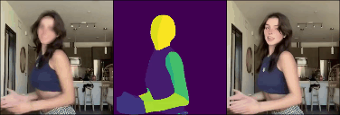

# Simple-Magic-Animate

This repository demostrates a simple pipeline of magic-animate usage, including human pose estimation using densepose. (which is the annoying part)  

## Original Github Repository Link
 - [Magic-Animate](https://github.com/magic-research/magic-animate) (Using Commit Version ae5faa8)
 - [Densepose from Detectron2](https://github.com/facebookresearch/detectron2/tree/main/projects/DensePose)

## Environment Setup
I recommend using two different environments as there might be a version conflict. Please refer to their github repositories for environment setup. Please also note that using densepose require detectron2 installed. See [here](https://detectron2.readthedocs.io/en/latest/tutorials/install.html) for more details.

## How to use it?

  <table align="center">
    <tr>
    <td>
      
    </td>
    <td>
      
    </td>
    </tr>
    <tr>
    <td>
      
    </td>
    <td>
      
    </td>
    </tr>
  </table>

To run magic-animate, we'll need:
 - A reference image
 - A motion sequence (Generated by densepose)

Resolution is set at 512 x 512 for better result, you can also try different resolutions. Examples provided by magic-animate are in `magic/animate/exp_data`.  

### Steps to run inference
**Change the paths and numbers before you run it.**  

For image, you can crop and resize it by yourself, or use `magic-animate/crop_image.py` to do so with OpenCV.  

For motion sequence, use `DensePose/apply_video.py` to generate motion sequence, then use `magic-animate/pad_video.py` to pad it and resize it into 512 x 512. Use `magic-animate/crop_video.py` if needed. The model config file I used is `densepose_rcnn_R_101_FPN_DL_s1x.yaml`, and model checkpoint can be downloaded from [here](https://dl.fbaipublicfiles.com/densepose/densepose_rcnn_R_101_FPN_DL_s1x/165712116/model_final_844d15.pkl), see [Densepose Readme (R_101_FPN_DL_s1x)](https://github.com/facebookresearch/detectron2/blob/main/projects/DensePose/doc/DENSEPOSE_IUV.md#-improved-baselines-deeplabv3-head) for more details.

Finally, use `magic-animate/inference.py` to run magic-animate inference. You should be able to find your results at `magic-animate/outputs/{time}`. (Inference code is from [here](https://github.com/magic-research/magic-animate/issues/71))

### Examples

---

Feel free to reach out if there's anything unclear, I'll try my best to help. If you find this repository useful, please consider leave a star ⭐ 

Thanks :)

